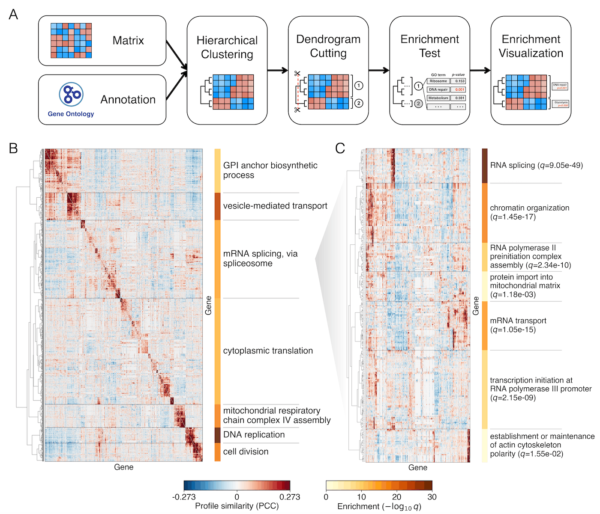

# Introduction

Hierarchically clustered matrices commonly represent high-dimensional biological data and are widely used for visualization. Although methods exist to assess cluster stability, dendrogram-defined clusters are rarely used for statistical inference. HiMaLAYAS is a general framework for post hoc enrichment-based annotation and visualization of hierarchically clustered matrices. It treats dendrogram-defined clusters as statistical units, tests categorical annotations for enrichment, controls multiple testing, and renders significant annotations alongside clusters.

**HiMaLAYAS workflow and application to a hierarchically clustered yeast
genetic interaction profile similarity matrix (Costanzo _et al_., 2016)**.
A real-valued matrix and categorical annotations serve as inputs. HiMaLAYAS
cuts the dendrogram at a user-defined threshold, tests categorical annotations
for enrichment, controls multiple testing, and renders significant annotations
alongside clusters.

## Core Ideas

- Hierarchical clustering organizes rows and columns into contiguous regions that can be treated as clusters.
- Clusters are produced by cutting the dendrogram.
- Enrichment is tested across dendrogram-defined clusters and categorical annotations.
- Significant annotations are rendered alongside clusters for interpretation.
- The workflow is domain-agnostic as long as you have a matrix and categorical annotations.
- Enrichment can be evaluated at different dendrogram cut thresholds.

## Typical Use Cases

- _Saccharomyces cerevisiae_ genetic interaction matrices (Costanzo _et al_., 2016) with GO Biological Process enrichment.
- Expression similarity matrices with pathway enrichment.
- Non-biological matrices such as country-sector input-output matrices with metadata-based enrichment labels.

## The Basic Object Graph

- `Matrix`: labeled numeric matrix used for clustering and plotting.
- `Annotations`: term-to-label mapping aligned to the matrix label background.
- `Analysis`: orchestrates clustering, enrichment, and layout.
- `Results`: stores enrichment output and context for plotting.
- `Plotter`: builds layered figures.
