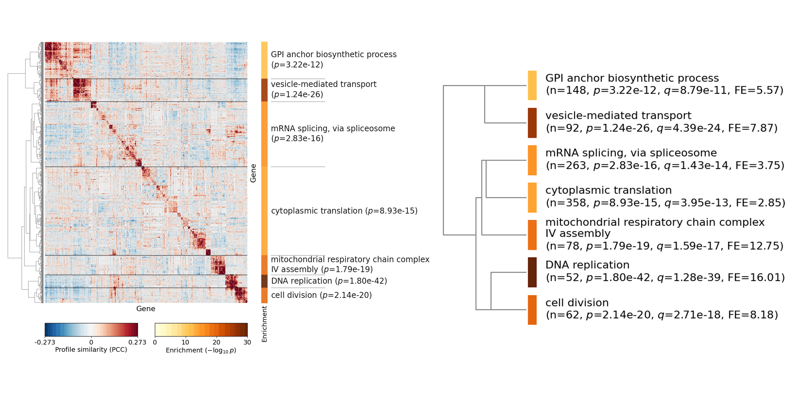
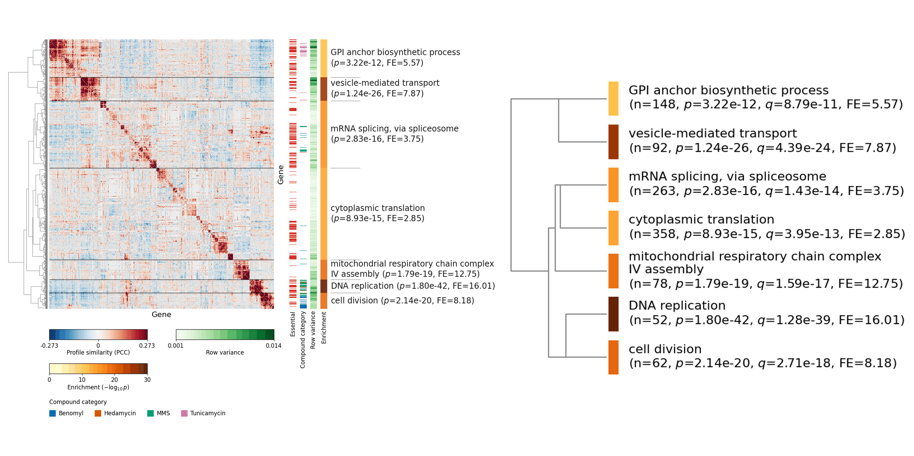
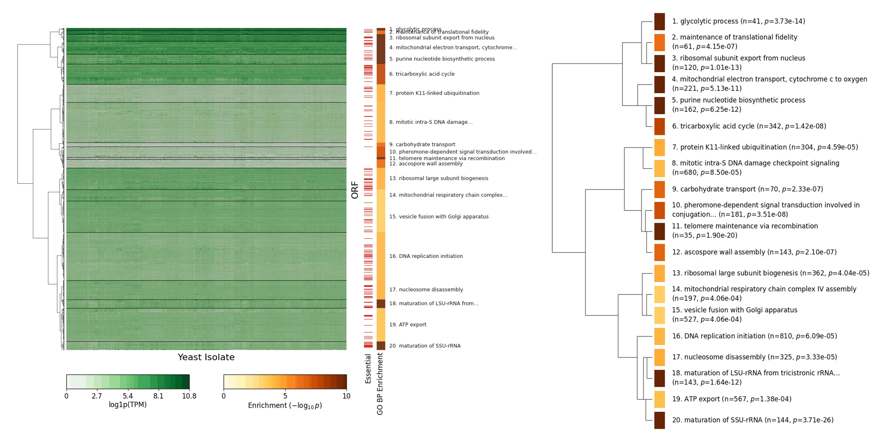
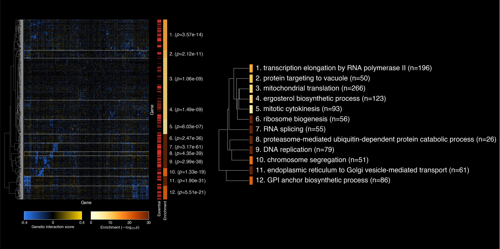
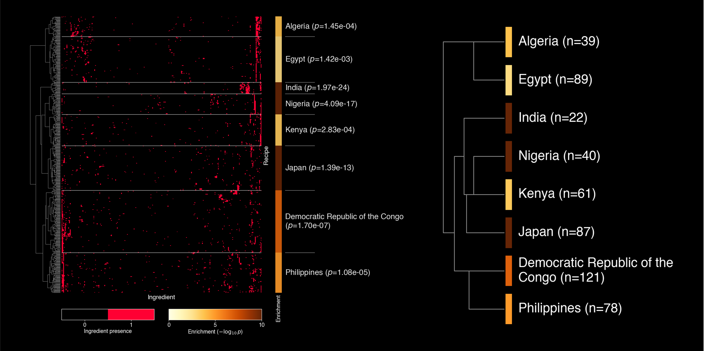

# Figure Gallery

Browse selected HiMaLAYAS figures across yeast genetic interaction and recipe-by-ingredient analyses.

## Gallery

  

    

      <strong>Figure 1.</strong> Yeast genetic interaction profile similarity matrix with enrichment-guided cluster annotations.
      Dataset: Costanzo et al. (2016) · Annotation: GO BP (yeast)
    

    
  

  

    

      <strong>Figure 1 Advanced.</strong> Yeast genetic interaction profile similarity matrix with compound classification and row variance tracks.
      Dataset: Costanzo et al. (2016) · Annotation: GO BP (yeast) · ChemGI rail: Piotrowski et al. (2017)
    

    
  

  

    

      <strong>Figure 2.</strong> Yeast pan-transcriptome expression matrix.
      Dataset: Caudal et al. (2024) · Annotation: GO BP (yeast)
    

    
  

  

    

      <strong>Supplementary Figure 1.</strong> Yeast genetic interaction score matrix.
      Dataset: Costanzo et al. (2016) · Annotation: GO BP (yeast)
    

    
  

  

    

      <strong>Supplementary Figure 2.</strong> Recipe-by-ingredient similarity matrix annotated by country of origin.
      Dataset: Magomere et al. (2025) · Annotation: Country of origin
    

    
  

## Citations

**Figure 1, Figure 1 Advanced, and Supplementary Figure 1**
 
Costanzo, M., VanderSluis, B., Koch, E. N., et al. (2016)
 
_A global genetic interaction network maps a wiring diagram of cellular function_
 
_Science_ 353, aaf1420.

**Figure 1 Advanced** (chemogenomic annotation)
 
Piotrowski, J. S., Li, S. C., Deshpande, R., et al. (2017)
 
_Functional annotation of chemical libraries across diverse biological processes_
 
_Nature Chemical Biology_ 13, 982–993.

**Figure 2**
 
Caudal, E., Loegler, V., Dutreux, F., et al. (2024)
 
_Pan-transcriptome reveals a large accessory genome contribution to gene expression variation in yeast_
 
_Nature_.

**Supplementary Figure 2**
 
Magomere, J., Ishida, S., Afonja, T., et al. (2025)
 
_The world wide recipe: a community-centred framework for fine-grained data collection and regional bias operationalisation_
 
_Proc. ACM Conf. Fairness, Accountability and Transparency_, 246–282.

**Generated with HiMaLAYAS**
 
Horecka, I., and Röst, H. (2026)
 
_HiMaLAYAS: enrichment-based annotation of hierarchically clustered matrices_
 
_bioRxiv_. [https://www.biorxiv.org/content/10.64898/2026.02.11.705303v2](https://www.biorxiv.org/content/10.64898/2026.02.11.705303v2)
