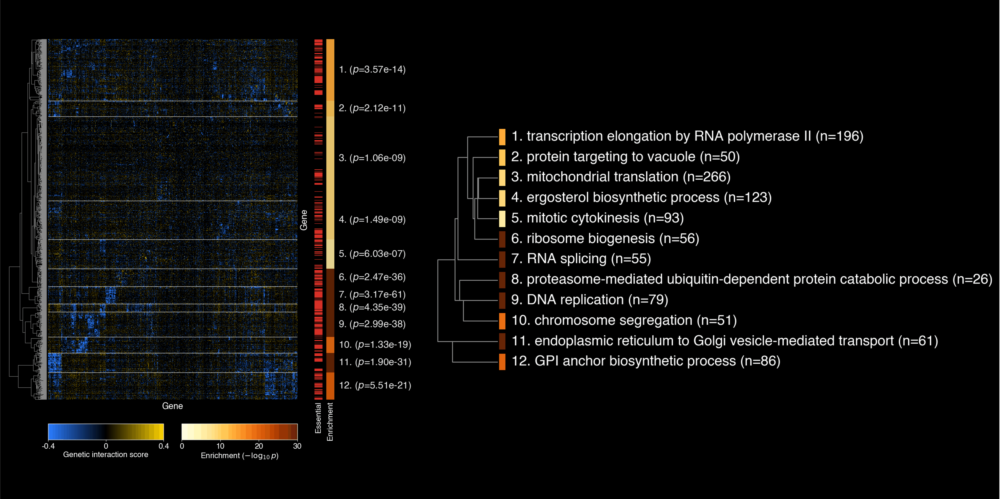
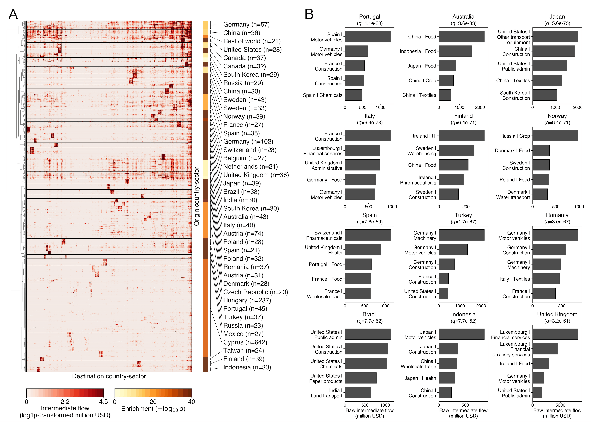
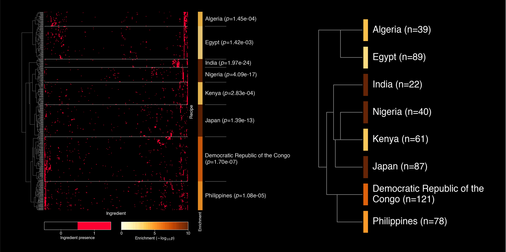

# Example Gallery

Browse selected HiMaLAYAS example outputs. These examples are illustrative documentation assets; submitted manuscript figure numbering is tracked in the `himalayas-publication` repository.

## Gallery

  

    

      <strong>Yeast genetic interaction profile similarity matrix.</strong> Yeast genetic interaction profile similarity matrix with enrichment-guided cluster annotations.
      Dataset: Costanzo et al. (2016) · Annotation: GO BP (yeast)
    

    
  

  

    

      <strong>Yeast genetic interaction profile similarity matrix with row tracks.</strong> Yeast genetic interaction profile similarity matrix with essentiality and single-mutant fitness row tracks.
      Dataset: Costanzo et al. (2016) · Annotation: GO BP (yeast) · Row tracks: essentiality and single-mutant fitness
    

    
  

  

    

      <strong>Yeast pan-transcriptome example.</strong> Yeast pan-transcriptome expression matrix.
      Dataset: Caudal et al. (2024) · Annotation: GO BP (yeast)
    

    
  

  

    

      <strong>Yeast GI-score example.</strong> Yeast genetic interaction score matrix.
      Dataset: Costanzo et al. (2016) · Annotation: GO BP (yeast)
    

    
  

  

    

      <strong>WIOD country-sector input-output example.</strong> Non-biological country-sector input-output matrix annotated by country metadata.
      Dataset: WIOD 2016 release, 2014 table · Annotation: Country metadata
    

    
  

  

    

      <strong>World Wide Dishes recipe-ingredient example.</strong> Non-biological recipe-ingredient matrix annotated by country metadata.
      Dataset: World Wide Dishes · Annotation: Country metadata
    

    
  

## Citations

**Yeast genetic interaction profile similarity, row-track, and GI-score examples**
 
Costanzo, M., VanderSluis, B., Koch, E. N., et al. (2016)
 
_A global genetic interaction network maps a wiring diagram of cellular function_
 
_Science_ 353, aaf1420.

**Yeast pan-transcriptome example**
 
Caudal, E., Loegler, V., Dutreux, F., et al. (2024)
 
_Pan-transcriptome reveals a large accessory genome contribution to gene expression variation in yeast_
 
_Nature_.

**WIOD country-sector input-output example**
 
Timmer, M. P., Dietzenbacher, E., Los, B., Stehrer, R., and de Vries, G. J. (2015)
 
_An Illustrated User Guide to the World Input–Output Database: the Case of Global Automotive Production_
 
_Review of International Economics_ 23, 575–605.

**World Wide Dishes recipe example**
 
Magomere, J., Ishida, S., Afonja, T., Salama, A., Kochin, D., Yuehgoh, F., Hamzaoui, I., Sefala, R., Alaagib, A., Dalal, S., Marchegiani, B., Semenova, E., Crais, L., and Mackenzie Hall, S. (2024; revised 2025)
 
_The World Wide recipe: A community-centred framework for fine-grained data collection and regional bias operationalisation_
 
_arXiv_ 2406.09496. [https://doi.org/10.48550/arXiv.2406.09496](https://doi.org/10.48550/arXiv.2406.09496)

**Generated with HiMaLAYAS**
 
Horecka, I., and Röst, H. (2026)
 
_HiMaLAYAS: enrichment-based annotation and visualization of hierarchically clustered matrices_
 
_bioRxiv_. [https://www.biorxiv.org/content/10.64898/2026.02.11.705303v2](https://www.biorxiv.org/content/10.64898/2026.02.11.705303v2)
